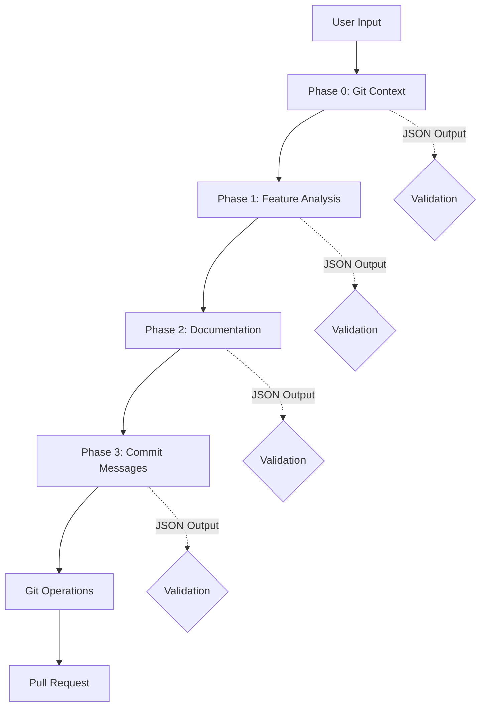

# Claude Flow Orchestrator

🚀 An intelligent external orchestration system that revolutionizes AI-assisted software development by combining Claude's intelligence with deterministic workflow execution.

## 🎯 What is Claude Flow Orchestrator?

Claude Flow Orchestrator is a Python-based workflow automation system that bridges the gap between AI capabilities and traditional software development processes. It implements a phase-based architecture that separates intelligent decision-making (handled by Claude) from deterministic execution (handled by Python scripts).

### Key Innovation

Unlike traditional AI-assisted development where the AI controls the entire process, Claude Flow Orchestrator uses an **external orchestration pattern**:
- **Claude** provides intelligence, analysis, and content generation
- **Python** handles execution, validation, and state management
- **You** maintain full control and visibility over the entire process

## 🌟 Why Use Claude Flow Orchestrator?

### For Individual Developers
- **Automate repetitive tasks**: Feature analysis, test documentation, commit messages
- **Ensure consistency**: Validated outputs, standardized workflows
- **Save time**: Automated Git operations, PR creation, documentation
- **Learn best practices**: AI-generated suggestions follow industry standards

### For Teams
- **Standardize workflows**: Everyone follows the same validated process
- **Improve documentation**: Consistent, comprehensive test documentation
- **Enhance code quality**: AI-assisted analysis catches potential issues
- **Accelerate onboarding**: New developers can leverage AI guidance

## 🔧 How It Works

1. **You** initiate a workflow with a feature name
2. **System** analyzes your Git repository state
3. **Claude** analyzes feature requirements and dependencies
4. **System** creates and switches to a feature branch
5. **Claude** generates comprehensive test documentation
6. **System** commits changes with AI-generated messages
7. **System** optionally creates a pull request with detailed description

## 🏗️ Architecture

### Workflow Phases



#### Phase Details

**Phase 0: Git Context Analysis**
- Analyzes current repository state
- Determines base branch and uncommitted changes
- Outputs: branch info, modified files, recent commits

**Phase 1: Feature Analysis**
- Intelligent analysis of feature requirements
- Identifies affected components and dependencies
- Outputs: implementation plan, test requirements, affected files

**Phase 2: Documentation Generation**
- Creates comprehensive test documentation
- Follows project-specific conventions
- Outputs: test files, documentation updates

**Phase 3: Commit Message Generation**
- Generates semantic commit messages
- Creates pull request descriptions
- Outputs: commit message, PR title and body

### Validation System

Every Claude output is validated against strict JSON schemas:
- Failed validations trigger automatic retries
- Enhanced prompts guide Claude to correct outputs
- Maximum 3 retry attempts per phase

## 📋 Prerequisites

- **Python 3.8+** - Required for the orchestration system
- **Claude CLI** - Install via `pip install claude-code`
- **Git** - For version control operations
- **GitHub CLI** (optional) - For automated PR creation (`gh` command)

## 🚀 Installation

### Quick Start

```bash
# Clone the repository
git clone <your-repo-url>
cd claude_flow

# Create virtual environment (recommended)
python -m venv venv
source venv/bin/activate  # On Windows: venv\Scripts\activate

# Install dependencies
pip install -r requirements.txt

# Verify Claude CLI is installed
claude --version

# Verify Git is configured
git config --global user.name
git config --global user.email
```

### Dependencies

**Core Dependencies:**
- `jsonschema>=4.17.0` - JSON Schema validation for Claude outputs
- `PyYAML>=6.0` - Configuration file support
- `colorlog>=6.7.0` - Enhanced logging with colors
- `click>=8.1.3` - CLI enhancements

**Development Dependencies:**
- `pytest>=7.2.0` - Testing framework
- `pytest-mock>=3.10.0` - Mock support for testing
- `black>=23.1.0` - Code formatting
- `flake8>=6.0.0` - Code linting
- `mypy>=1.0.0` - Type checking

## Usage

### Basic Usage

```bash
# Run a complete workflow for a new feature
python orchestrator.py user-authentication

# Dry run mode (no Git changes)
python orchestrator.py user-authentication --dry-run

# Resume from last saved state
python orchestrator.py user-authentication --resume

# Clean up workflow files
python orchestrator.py user-authentication --cleanup
```

### Workflow Phases

1. **Git Context Analysis**: Analyzes current repository state
2. **Feature Analysis**: Determines components, tests, and dependencies
3. **Documentation Generation**: Creates test documentation
4. **Commit Messages**: Generates commit and PR messages

### ⚙️ Configuration

The system is highly configurable via `config.yaml`. Here are key settings:

#### Claude Settings
```yaml
claude:
  command: "claude"         # Path to Claude CLI
  timeout: 300              # Seconds before timeout
  max_retries: 3            # Retry attempts on failure
  temperature: 0.7          # Claude's creativity level
```

#### Git Settings
```yaml
git:
  default_base_branch: "main"      # or "master", "develop"
  branching_strategy: "feature-branch"  # or "git-flow"
  auto_push: true                  # Push after commits
  create_pr: true                  # Create PR automatically
  pr_base_branch: "main"          # Target for PRs
```

#### Workflow Settings
```yaml
workflow:
  cache_outputs: true         # Save phase outputs
  cleanup_on_success: false   # Keep workflow files
  dry_run_by_default: false   # Default to dry-run mode
  state_directory: ".claude-workflow"
```

#### Logging Settings
```yaml
logging:
  level: "INFO"              # DEBUG for troubleshooting
  format: "colored"          # or "simple", "json"
  file: "workflow.log"       # Log file location
```

### 📝 Example Workflows

#### Basic Feature Development

```bash
$ python orchestrator.py user-authentication

🚀 Starting workflow for feature: user-authentication

📊 Phase 0: Analyzing Git context...
   ✓ Current branch: develop
   ✓ No uncommitted changes
   ✓ Remote is up to date

🔍 Phase 1: Analyzing feature requirements...
   ✓ Identified 3 components to modify
   ✓ Detected Python project (Django framework)
   ✓ Test strategy: unit + integration tests

🌿 Creating feature branch: feature/user-authentication
   ✓ Branch created and checked out

📝 Phase 2: Generating documentation...
   ✓ Created: docs/tests/user_authentication_tests.md
   ✓ Test cases: 12 unit, 5 integration
   ✓ Coverage areas: login, logout, session management

💬 Phase 3: Generating commit messages...
   ✓ Commit message generated
   ✓ PR description prepared

📦 Executing Git operations...
   ✓ Changes staged: 1 file
   ✓ Commit created: "docs(auth): add comprehensive test documentation"
   ✓ Branch pushed to origin

🔗 Creating pull request...
   ✓ PR created: https://github.com/user/repo/pull/42
   ✓ Title: "Feature: User Authentication Test Documentation"
   ✓ Labels: documentation, testing

✅ Workflow completed successfully!
```

#### Dry Run Mode

```bash
$ python orchestrator.py payment-gateway --dry-run

🚀 Starting workflow for feature: payment-gateway [DRY RUN MODE]

📊 Phase 0: Analyzing Git context...
   ✓ Would analyze: current branch, uncommitted changes

🔍 Phase 1: Analyzing feature requirements...
   ✓ Would identify: affected components, dependencies

🌿 Would create branch: feature/payment-gateway
   ⚠️  Skipped: Dry run mode

📝 Phase 2: Generating documentation...
   ✓ Would create: docs/tests/payment_gateway_tests.md
   ⚠️  File not written: Dry run mode

✅ Dry run completed - no changes made
```

#### Resume Interrupted Workflow

```bash
$ python orchestrator.py user-profile --resume

🔄 Resuming workflow from Phase 2...
   ✓ Loaded state from .claude-workflow/state.json
   ✓ Previous phases outputs restored

📝 Phase 2: Generating documentation...
   ✓ Created: docs/tests/user_profile_tests.md

[Continues from interruption point...]
```

## 📁 Project Structure

```
claude_flow/
├── 🔧 Core Components
│   ├── orchestrator.py          # Main orchestration engine
│   ├── claude_interface.py      # Claude CLI wrapper
│   ├── git_operations.py        # Git operations handler
│   ├── validators.py            # JSON validation logic
│   ├── schemas.py               # JSON schemas for phases
│   └── prompts.py               # Prompt templates
│
├── ⚙️ Configuration
│   ├── config.yaml              # Main configuration
│   └── workflows/               # Custom workflow definitions
│       └── example_workflow.yaml
│
├── 📚 Documentation
│   ├── README.md                # This file
│   ├── docs/
│   │   ├── architecture.md      # System architecture
│   │   ├── project.md           # Original concept
│   │   ├── future-enhancements.md
│   │   └── tests/               # Generated test docs
│
├── 🧪 Examples & Tests
│   ├── example_usage.py         # Usage examples
│   ├── requirements.txt         # Dependencies
│   └── requirements-dev.txt     # Dev dependencies
│
└── 🗂️ Runtime (git-ignored)
    └── .claude-workflow/
        ├── state.json           # Workflow state
        ├── phase_outputs/       # JSON outputs
        │   ├── phase_0_*.json
        │   ├── phase_1_*.json
        │   └── ...
        └── logs/                # Execution logs
```

## Advanced Features

### Custom Prompts

Create custom prompt templates by:

1. Adding them to `prompts.py`
2. Or creating a custom prompts directory and setting it in `config.yaml`

### Validation

The system validates all Claude outputs against JSON schemas. Failed validations trigger retries with enhanced prompts.

### Error Recovery

- Automatic retry with enhanced prompts on validation failure
- State persistence allows resuming interrupted workflows
- Detailed logging for debugging

### Dry Run Mode

Test workflows without making actual changes:

```bash
python orchestrator.py feature-name --dry-run
```

## 🐛 Troubleshooting

### Common Issues and Solutions

#### 1. Claude CLI Issues

**Problem**: `claude: command not found`
```bash
# Solution 1: Install Claude CLI
pip install claude-code

# Solution 2: Use full path in config.yaml
claude:
  command: "/path/to/claude"

# Solution 3: Add to PATH
export PATH="$PATH:$(python -m site --user-base)/bin"
```

**Problem**: Claude timeout errors
```yaml
# Increase timeout in config.yaml
claude:
  timeout: 600  # 10 minutes for complex features
```

#### 2. Git Issues

**Problem**: "Uncommitted changes detected"
```bash
# Check status
git status

# Stash changes temporarily
git stash

# Run workflow
python orchestrator.py feature-name

# Restore changes
git stash pop
```

**Problem**: "Failed to push branch"
```bash
# Check remote configuration
git remote -v

# Set upstream if needed
git push -u origin feature-branch-name
```

#### 3. Validation Errors

**Problem**: "JSON validation failed"
```bash
# Check the specific phase output
cat .claude-workflow/phase_outputs/phase_1_*.json

# Enable debug mode for detailed errors
python orchestrator.py feature-name --debug

# View validation schema
python -c "import schemas; print(schemas.PHASE_1_SCHEMA)"
```

#### 4. Workflow State Issues

**Problem**: "Cannot resume workflow"
```bash
# Check state file exists
ls -la .claude-workflow/state.json

# Validate state file
python -c "import json; json.load(open('.claude-workflow/state.json'))"

# Clean up and restart
python orchestrator.py feature-name --cleanup
python orchestrator.py feature-name
```

### 🔍 Debug Mode

```bash
# Run with debug output
python orchestrator.py feature-name --debug

# Or set in config.yaml
logging:
  level: "DEBUG"
  format: "detailed"
```

### 📊 Viewing Logs

```bash
# View latest log
tail -f .claude-workflow/logs/workflow_*.log

# View phase-specific output
cat .claude-workflow/phase_outputs/phase_1_*.json | jq .

# Check Claude's raw output
grep "Claude output:" .claude-workflow/logs/workflow_*.log
```

## 🚀 Advanced Features

### Custom Workflows

Create custom workflows in `workflows/` directory:

```yaml
# workflows/custom_feature.yaml
name: "Custom Feature Workflow"
phases:
  - name: "Custom Analysis"
    prompt_template: "custom_analysis"
    schema: "custom_schema"
    retries: 5
```

### Hooks and Extensions

```yaml
# config.yaml
hooks:
  pre_phase: "scripts/pre_phase.py"
  post_phase: "scripts/post_phase.py"
  on_error: "scripts/error_handler.py"
```

### Multi-Project Support

The system auto-detects project types:
- **Python**: Django, Flask, FastAPI
- **JavaScript**: React, Vue, Node.js
- **TypeScript**: Angular, Next.js
- **Go**: Standard library, Gin, Echo

## 🧑‍💻 Development

### Setting Up Development Environment

```bash
# Clone and setup
git clone <repo-url>
cd claude_flow
python -m venv venv
source venv/bin/activate

# Install dev dependencies
pip install -r requirements.txt
pip install -r requirements-dev.txt

# Run tests
pytest

# Code formatting
black .

# Type checking
mypy .

# Linting
flake8
```

### Running Tests

```bash
# All tests
pytest

# Specific test file
pytest tests/test_orchestrator.py

# With coverage
pytest --cov=claude_flow
```

## 🤝 Contributing

We welcome contributions! Please see our [Contributing Guide](CONTRIBUTING.md) for details.

1. Fork the repository
2. Create a feature branch (`git checkout -b feature/amazing-feature`)
3. Commit your changes (`git commit -m 'Add amazing feature'`)
4. Push to the branch (`git push origin feature/amazing-feature`)
5. Open a Pull Request

## 📚 Additional Documentation

- [System Architecture](docs/architecture.md) - Detailed technical architecture
- [Project Concept](docs/project.md) - Original design and rationale
- [Future Enhancements](docs/future-enhancements.md) - Roadmap and planned features
- [API Reference](docs/api.md) - Detailed API documentation

## 🗺️ Roadmap

### Near Term
- [ ] Web UI for workflow monitoring
- [ ] VSCode extension
- [ ] Custom workflow templates
- [ ] Slack/Discord notifications

### Long Term
- [ ] CI/CD pipeline integration
- [ ] Multi-language support expansion
- [ ] Distributed workflow execution
- [ ] AI model selection (GPT-4, Claude, etc.)

## ⚖️ License

This project is currently unlicensed. We recommend adding a LICENSE file (MIT, Apache 2.0, or your preferred license).

## 🙏 Acknowledgments

- Built for the Claude AI community
- Inspired by modern DevOps practices
- Designed for developers, by developers

---

<p align="center">
  Made with ❤️ using Claude and Python
</p>